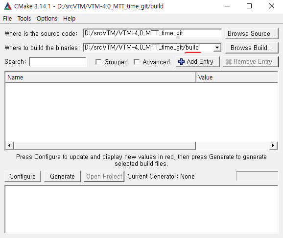

# C-TTD
Context-Based Ternary Tree Decision Method in Versatile Video Coding for Fast Intra Coding (Access, 2019)
Link: https://ieeexplore.ieee.org/abstract/document/8915688

# Installation and compilation
Official VTM software can be downloaded from GitLab server at: https://vcgit.hhi.fraunhofer.de/jvet/VVCSoftware_VTM

Build recommendation: using CMake.

Example of installation using MS Visual Studio on Windows:
- You need Visual Studio 2015/2017 and recent CMake.
- Plain version: 
    * cd build
    * cmake .. -G "Visual Studio 14 2015 Win64"
- GUI-based version:
   * Ensure that the address for building binaries should contain a folder named "build" as shown in the below figure.
   * Configure --> Generate
   

# Proposed Method for TT (As in the paper)
Entire solution for the proposed method written in C++ under VS2017: [code](proposed_method)
The core part of the propsoed method is in [EncoderLib](proposed_method/source/Lib/EncoderLib/). Particulary, see "EncCu.cpp"

# Time Measure for BT/TT
Encoding time of CUs for BT and TT is measured on top of official VTM software. Thus, one needs to know how to handle VTM encoding.

Languague features: 
  * C++11
  * Supported Compilers: MS Visual Studio 2015/2017, GCC 5.4/7.3, Xcode/clang	

Description:
  - Global variables that measures BT/TT times. Herein we measure the time for only "xCheckRDCostIntra" that conducts intra prediction and the associated T/Q processes.
  - Parent CU should inherit what the type of BT/TT is for sub-CUs to child CUs. Then, the child CUs can know what the current tree type is.
  - Measure the time for intra prediction and accumulate the time per tree type. That means, BT and TT time of Fig. 1 in the paper precisely means intra prediction time per each tree type.

# Citation
S. Park and J. Kang, "Context-Based Ternary Tree Decision Method in Versatile Video Coding for Fast Intra Coding," in IEEE Access, vol. 7, pp. 172597-172605, 2019.
doi: 10.1109/ACCESS.2019.2956196

@ARTICLE{8915688,
   author={S. {Park} and J. {Kang}},
   journal={IEEE Access},
   title={Context-Based Ternary Tree Decision Method in Versatile Video Coding for Fast Intra Coding},
   year={2019},
   volume={7},
   number={},
   pages={172597-172605},
   keywords={Encoding;Complexity theory;Vegetation;Redundancy;Copper;Video coding;Streaming media;Versatile video coding;high efficiency video coding;multi-type tree;encoder complexity;intra-prediction},
   doi={10.1109/ACCESS.2019.2956196},
   ISSN={2169-3536},
   month={},}
